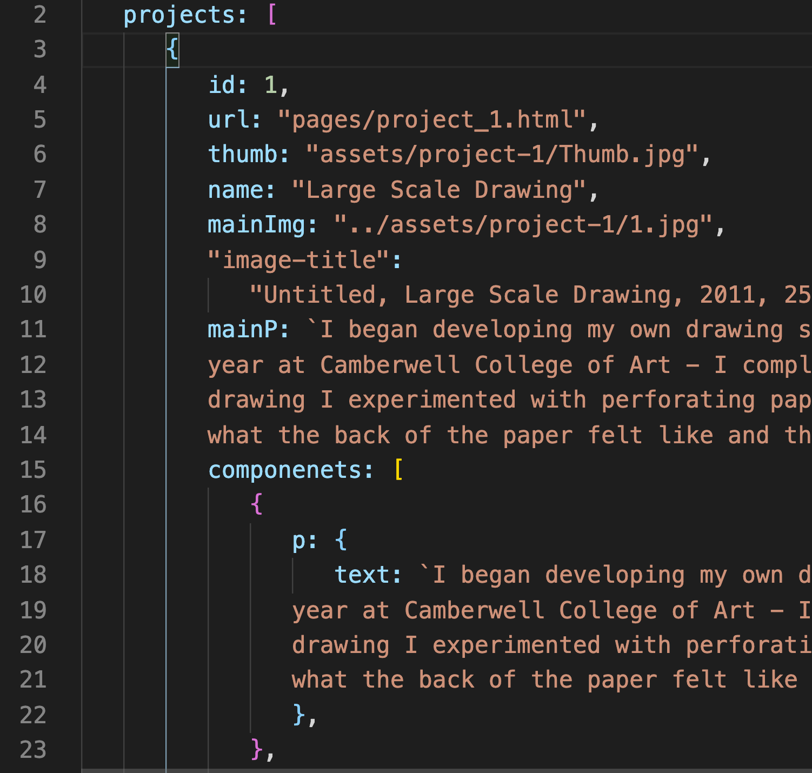

# 📓 Scarlet Lingwood Studio website source

##### [🌎](www.scarlettLingwoodStudio.com) live on [ www.scarlettLingwoodStudio.com ](www.scarlettLingwoodStudio.com)

### 🎨 Add content
   - Add project content block to `data.js`
 

### ⚙️ Deployment
- **project deployment process**: push to main => github actions => to aws S3 => aws cloudFront distribution
- **view GitHub actions progress**: https://github.com/ronerlih/scarlettlingwoodstudio/actions
-  **aws s3 bucket**: https://s3.console.aws.amazon.com/s3/buckets/www.scarlettlingwoodstudio.com?region=us-east-1&tab=objects
-  **aws cloudFront**: https://console.aws.amazon.com/cloudfront/home?region=us-east-1#distribution-settings:E2CUN6WAD2D83U

